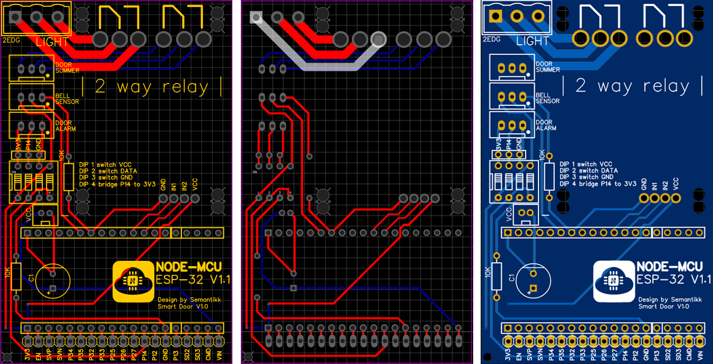
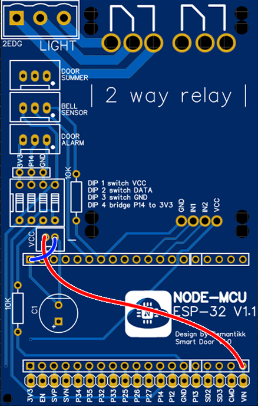
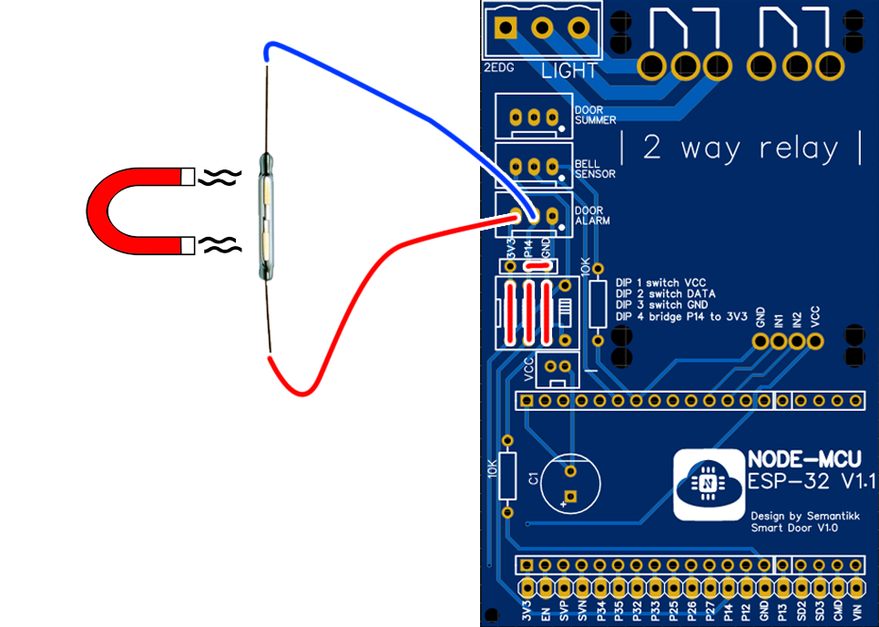

 

    

  <h3 align="center">Telegram - Tür Portier</h3>

<!-- Theorie -->
## Theorie

Die Platine dient als BreakOut Board für den ESP32 und stellt div. Ausgänge zur Verfügung. 
Dabei ist sie zur Steuerung der Gegensprechanlage gedacht, lässt sich aber auch jederzeit in andere Projekte einplanen.   
Die untere Stiftleiste ermöglicht es, zusätzliche Boards mit in das System zu integrieren, diese ist direkt mit den Ausgängen des ESP darüber verbunden.
Die Stiftleiste über dem DIP-Schalter lässt die JST-XH Buchse modular anpassen. Benötigt man z.b. 5V anstatt 3v3 so schaltet man den ersten DIP Schalter ab und verbindet VCC direkt mit dem dazugehörigen Kontakt der Stiftleiste. 

Eingeplante Funktionen sind:
- Schaltung eines 230V Singals (Light)
- Schaltung einer Kleinspannung (Door Summer)
- Auslesen eines Tür-Kontaktes (Door Alarm)
- Auslesen der Klingel (Bell Sensor) 

<!-- Hardware -->
## Hardware

### Stromversorgung

Der ESP benötigt 5V, dies kann entweder über den externen Eingang auf der Platine (VCC) Erfolgen oder über den Micro USB eingang des ESPs.
Die Stromstärke sollte dabei nicht unter 1 Ampere liegen.

der Kondensator ist optional. 

### Löten

Gelötet wird von klein nach groß. 

### Relais

Aus Kostengründen wurden die beiden Relais nicht direkt auf der Platine geplant. Es ist schlicht günstiger ein fertiges Modul auf die Hauptplatine zu löten. 
Nun ist das etwas tricky. 
Die Stiftleiste zur Stromversorgung muss entlötet, ausgetauscht und umgedreht werden. 
Analog dazu die beiden Schraubterminals. Hilfreich hierfür kann es sein zusätzliches Lötzinn auf die Kontakte aufzutragen.

Die fehlende Passgenauigkeit muss man mit den Ausgängen des Relais-Modul ausgleichen. Hierfür Lötet man einzelne Stifte einer Stiftleiste bereits schief ein und setzt diese dann in die extra groß gewählten Löcher der Hauptplatine ein. 

Der Linke Ausgang ist für 230V Gedacht, sollte jedoch nur einen kurzen Schaltimpuls abgeben. Vorsicht vor offenen Kontakten mit Netzspannung.
Der Rechte dient für den Tür-Summer und geht auf den Steckplatz "DOOR-SUMMER".

### DOOR-ALARM

der Stecker für den Alarm ist modular. Mit den DIP Schaltern können einzelne Verbindungen getrennt und anders angesteuert werden.
Vorgesehen ist 
- Pin 1 3V3
- Pin 2 GPIO 14
- Pin 3 GND 

Wird GPIO 14 auf 3v3 kurzgeschlossen erkennt der ESP die Tür als geschlossen, liegt keine Spannung an als offen. 
Hardwareseitig kann man den Alarm durch den DIP Schalter Nr. 4 deaktivieren. Dieser schließt eine Verbindung zwischen 3v3 und GPIO14. 

Als Schalter ist ein "Reed-Switch" bzw Magnetschalter vorgesehen. Dieser schaltet auf Durchgang wenn er in die Nähe eines Magneten kommt.
Der Reed-Switch bekommt einseitig 3v3 und muss auf der anderen mit GND **und** GPIO verbunden werden.
Dafür empfiehlt es sich, die beiden Kontakte an der Stiftleiste mit einem Jumper zu verbinden 

### BELL-SENSOR

work in progress
